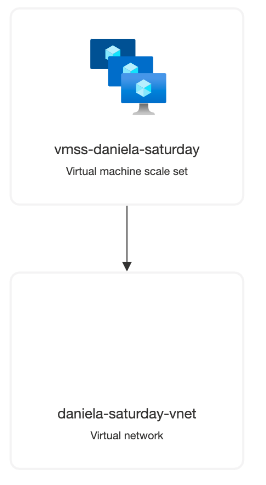

# azurerm-scaleset-deploy

Terraform configuration to deploy a virtual machine scale set with windows OS in azure cloud.

The backend is managed by terraform cloud.

The purpose of this scale set would be to be used as pipeline agents, that's why the lifecycle changes to instances and tags are ignored. Because Azure Devops will manage that in the future.

