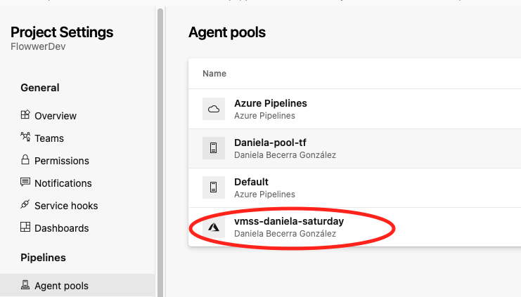
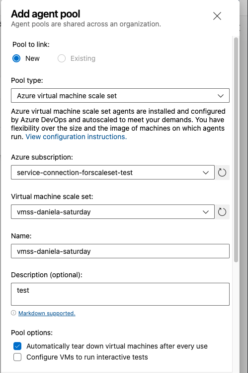
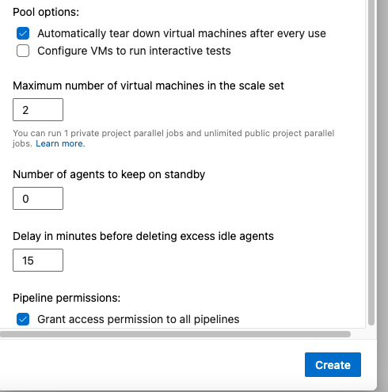

# azurerm-scaleset-deploy

Terraform configuration to deploy a virtual machine scale set with windows OS in azure cloud.

The backend is managed by terraform cloud.

The purpose of this scale set would be to be used as pipeline agents, that's why the lifecycle changes to instances and tags are ignored. Because Azure Devops will manage that in the future.

In Azure Devops, this agent pool will be automatically scaled up and down as needed.

This is useful if the machines are using a custom needs image to run your pipelines.

Making the relationship between the Azure scale set and the ADO agent pool is done manually in the ADO GUI.

An ARM service connection in ADO is a prerequisite for this.

